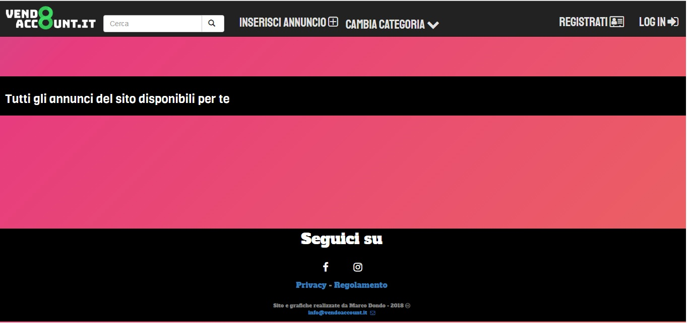
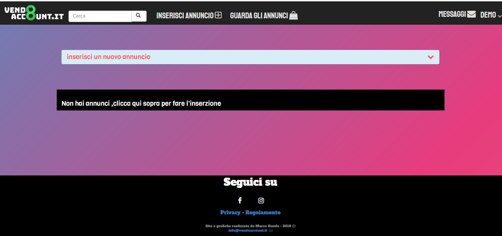
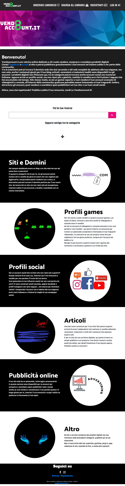

# Vendoaccount_website

<h2>Introduction</h2>
The project is a real website which aim is to profile users and allow them to insert announcements to sell their social profiles or games accounts, domains, digital advertising spaces.
In addition to this I added a messaging system, like a forum site, in order to give users the opportunity to write under the relevant ads.

<h2>Description</h2>
The site was built entirely in PHP.
The design is full responsive to adapt to navigation from smartphone or tablet. The template elements have been inserted through bootstrap 4, HTML5 and CSS3, and also JQuery library and animate.css 
The database on which the user information is allocated has been implemented with MySQL server APACHE.
Every graphic has been realized through ADOBE Illustrator.

the following project is for illustration purposes only.  
<b>Click this link to see and try the project</b>
 
https://vendoaccount.altervista.org/
 
<h2> Images </h2>

Screenshot 1

 Screenshot2
 
 
 Home page
 
 
 Responisive home page
 
 
